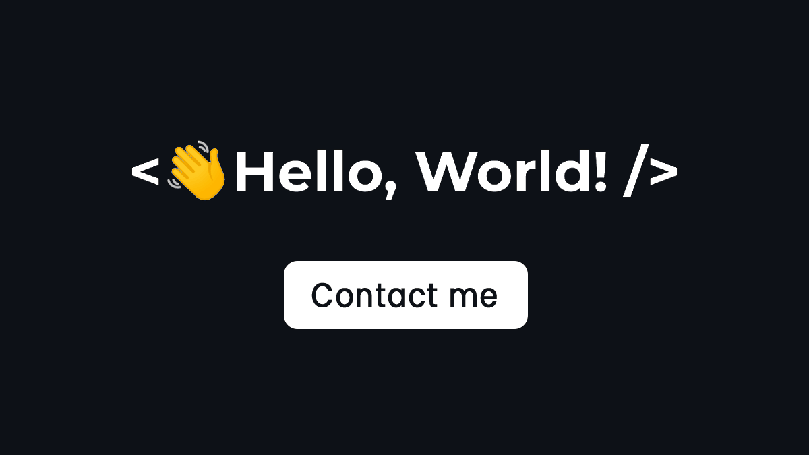

<h3 align="center">I'm Marco and i like Electronics & Informatics</h3>

  

- 🌱 I’m currently learning **web development at Boolean careers**

- 📫 How to reach me **marcobione.work@gmail.com**

- 📄 Know about my experiences [https://www.linkedin.com/in/marco-bione-91b0151b6/](https://www.linkedin.com/in/marco-bione-91b0151b6/)

- ⚡ Fun fact **your life starts when your confort zone ends**

<h3 align="left">Connect with me:</h3>

<h3 align="left">Languages and Tools:</h3>

       

